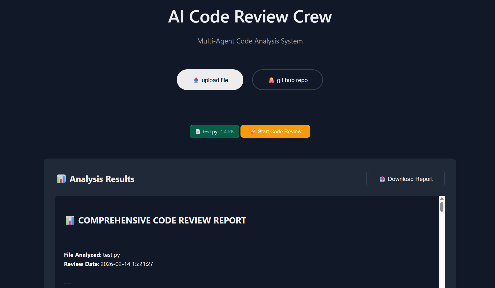

# AI Code Review Crew


A multi-agent AI system for automated code review. Five specialized agents collaborate to analyze Python code for bugs, security vulnerabilities, performance issues, and documentation quality.

## 🤖 The Agents

1. **Code Analyst** — Identifies logical errors, edge cases, and exception handling
2. **Security Expert** — Scans for OWASP Top 10 vulnerabilities and security flaws
3. **Performance Optimizer** — Detects algorithmic bottlenecks and inefficient patterns
4. **Documentation Specialist** — Reviews docstrings and code comments
5. **Quality Assurance** — Compiles final report with recommendations

## 🎯 Features

- **Dark Mode UI** — Modern FastAPI interface with drag-and-drop file upload
- **GitHub Integration** — Clone and analyze public repositories directly
- **Real-time Agent Status** — See which agent is currently analyzing your code
- **Detailed Reports** — Markdown reports with severity levels, line numbers, and suggested fixes
- **Multi-Agent Workflow** — Sequential task execution with context sharing

## 📁 Project Structure

```
3.Crew_AI_projects/
├── app.py                # FastAPI application
├── src/
│   ├── crew.py           # CrewAI orchestration logic
│   ├── logger.py         # Logging configuration
│   ├── config/
│   │   ├── agents.yaml   # Agent definitions
│   │   ├── tasks.yaml    # Task definitions
│   │   └── settings.py   # Application settings
│   └── static/           # Frontend
│       ├── index.html    # Main UI
│       ├── app.js        # JavaScript
│       └── style.css     # Dark mode styling
├── examples/             # Sample files for testing
├── output/               # Generated reports
├── logs/                 # Application logs
└── requirements.txt      # Python dependencies
```

## 🚀 Getting Started

### Prerequisites

- Python 3.8+
- OpenAI or Anthropic API key

### Installation

1. Clone the repository

```bash
git clone <your-repo-url>
cd 3.Crew_AI_projects
```

2. Install dependencies

```bash
pip install -r requirements.txt
```

3. Set up environment variables

```bash
cp .env.example .env
# Edit .env and add your OPENAI_API_KEY or ANTHROPIC_API_KEY
```

## 💻 Usage

### Running the Application

```bash
python app.py
```

The application will start on `http://localhost:8000`

## 📡 API Endpoints

- `GET /` - Serve main HTML page
- `GET /health` - Health check endpoint
- `POST /api/review/upload` - Review uploaded Python file
- `POST /api/review/github` - Review GitHub repository
- `GET /api/files/list` - List Python files in a GitHub repository
  
## 📸 Screenshots


_Code Review Interface showing code analogy_

### Upload a File

1. Select "Upload File" mode
2. Drop your `.py` file
3. Click "Start Code Review"
4. Download the generated report

### Review a GitHub Repo

1. Select "GitHub Repository" mode
2. Paste a public repo URL
3. Select files to analyze
4. Click "Analyze Selected Files"

## ☁️ AWS Deployment

Deployed as a containerized application on **AWS ECS Fargate + Application Load Balancer** for reliable, scalable AI code review.

### Architecture

- **Amazon ECR**: Stores Docker container image
- **ECS Fargate**: Runs containerized FastAPI app (serverless containers, no EC2 management)
- **Application Load Balancer**: Routes HTTP traffic to ECS tasks
- **Environment Variables**: API keys stored securely in ECS Task Definition

### Deployment Steps

1. **Build and push Docker image to ECR:**
```bash
# Login to ECR
aws ecr get-login-password --region us-east-1 | docker login --username AWS --password-stdin <AWS_ACCOUNT_ID>.dkr.ecr.us-east-1.amazonaws.com

# Build image
docker build --platform linux/amd64 -t crew-ai-fargate .

# Tag and push
docker tag crew-ai-fargate:latest <AWS_ACCOUNT_ID>.dkr.ecr.us-east-1.amazonaws.com/crew-ai-fargate:latest
docker push <AWS_ACCOUNT_ID>.dkr.ecr.us-east-1.amazonaws.com/crew-ai-fargate:latest
```

2. **Create ECS Cluster and Task Definition in AWS Console:**
   - Cluster: Fargate (serverless)
   - Task Definition: 1 vCPU, 2GB memory, port 8000
   - Environment variables: `OPENAI_API_KEY`, `LLM_PROVIDER`, `LLM_MODEL`

3. **Create ECS Service with Application Load Balancer:**
   - Target group: port 8000
   - Health check path: `/health`


## 📄 License

MIT License
