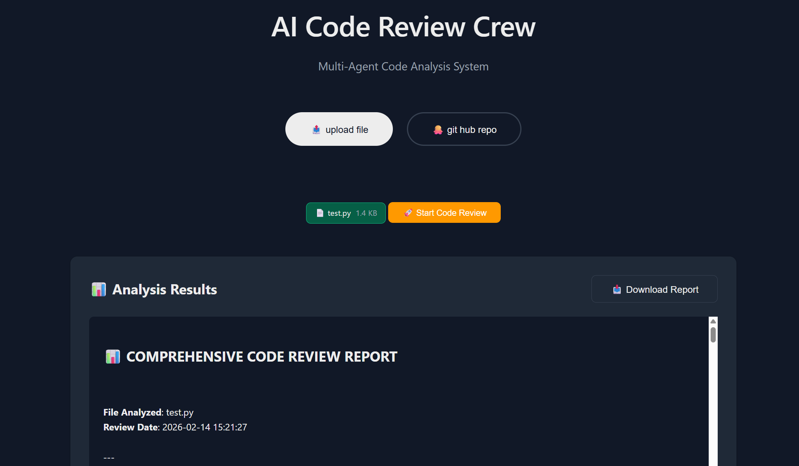

# AI Code Review Crew


A multi-agent AI system for automated code review. Five specialized agents collaborate sequentially to analyze Python code for bugs, security vulnerabilities, performance issues, and documentation quality.

> **Note:** Live demo not hosted (each review runs 5 LLM agents sequentially — available on request for demonstrations).

## 🤖 The Agents

1. **Code Analyst** — Identifies logical errors, edge cases, and exception handling issues
2. **Security Expert** — Scans for OWASP Top 10 vulnerabilities and security flaws
3. **Performance Optimizer** — Detects algorithmic bottlenecks and inefficient patterns
4. **Documentation Specialist** — Reviews docstrings, comments, and code clarity
5. **Quality Assurance** — Compiles the final report with prioritized recommendations

## 🎯 Features

- **File Upload** — Drag-and-drop Python file upload for instant review
- **GitHub Integration** — Clone and analyze public repositories directly from a URL
- **Real-time Agent Status** — See which agent is currently analyzing your code
- **Detailed Reports** — Markdown reports with severity levels, line numbers, and suggested fixes
- **Multi-Agent Workflow** — Sequential task execution with shared context between agents
- **Dark Mode UI** — Modern FastAPI interface

## 🛠️ Tech Stack

- **Backend**: FastAPI + Python 3.8
- **AI Framework**: CrewAI (multi-agent orchestration)
- **LLM**: OpenAI GPT-4
- **Frontend**: Vanilla JavaScript, HTML, CSS
- **Containerization**: Docker

## 🚀 Quick Start

### Prerequisites

- Python 3.8+
- OpenAI API key

### Installation

1. Clone the repository:

```bash
git clone https://github.com/francis-rf/code-review-crew.git
cd code-review-crew
```

2. Install dependencies:

```bash
pip install -r requirements.txt
```

3. Create `.env` file:

```bash
cp .env.example .env
# Edit .env and add your OPENAI_API_KEY
```

4. Run the application:

```bash
python app.py
```

5. Open browser:

`http://localhost:8000`

## 🐳 Docker Deployment

### Build and Run

```bash
docker build -t code-review-crew .
docker run -p 8000:8000 --env-file .env code-review-crew
```

## 💻 Usage

### Upload a File

1. Select **Upload File** mode
2. Drop your `.py` file onto the upload area
3. Click **Start Code Review**
4. Wait for all 5 agents to complete their analysis
5. Download the generated Markdown report

### Review a GitHub Repository

1. Select **GitHub Repository** mode
2. Paste a public GitHub repo URL
3. Select the files to analyze
4. Click **Analyze Selected Files**

## 📁 Project Structure

```
code-review-crew/
├── app.py                  # FastAPI application
├── src/
│   ├── crew.py             # CrewAI orchestration logic
│   ├── logger.py           # Logging configuration
│   └── config/
│       ├── agents.yaml     # Agent definitions (role, goal, backstory)
│       ├── tasks.yaml      # Task definitions
│       └── settings.py     # Application settings
├── static/                 # Frontend
│   ├── index.html
│   ├── app.js
│   └── style.css
├── examples/               # Sample Python files for testing
├── output/                 # Generated review reports
├── logs/                   # Application logs
├── Dockerfile
└── requirements.txt
```

## 📡 API Endpoints

| Method | Endpoint | Description |
|--------|----------|-------------|
| GET | `/` | Serves frontend UI |
| GET | `/health` | Health check |
| POST | `/api/review/upload` | Review an uploaded Python file |
| POST | `/api/review/github` | Review a GitHub repository |
| GET | `/api/files/list` | List Python files in a GitHub repository |

## 📸 Screenshots


_Code Review Interface showing multi-agent analysis_

## 📄 License

MIT License
